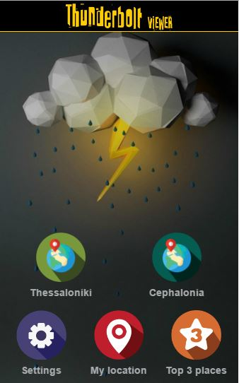
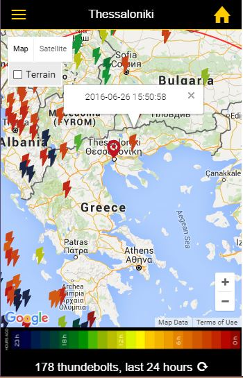
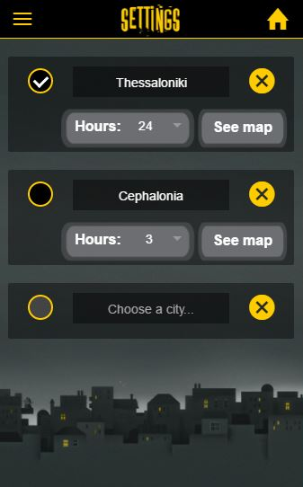
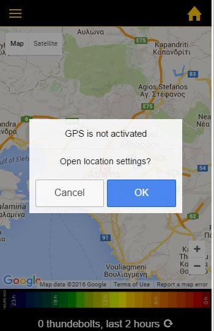

# ThunderboltViewer

## Apache cordova / Ionic / AngularJS Application

### Live interpretation of Ligthnings in Greece

**olezt**

#### Description

This application is a hybrid location based application - client side - that is designed to illustrate 
the activity of lightning in the territory of Greece in real time. Developed focusing on implementation 
for Android and iOS devices, but can, with certain modifications, be used in other operating systems 
such as windows phones or blackberry. Technologies used are Apache cordova, Ionic and AngularJS frameworks.

With the implementation of the application, users are allowed to be informed in real time
lightning activity in areas of their choice or their current location. To determine the location of
the user, GPS technology (Global Positioning System) of the device is being used. Furthermore,
the application gives the opportunity to the user to be informed about the sites with the most
thunderbolts in the last 24 hours in the broader area of Greece. The clustering of the thunderbolts
data, to determine these sites, is being processed with the use of the DBScan algorithm at server side - not included in this repository -.

#### Printscreens

  
  

#### Features

Location acquisition
Network state acquisition
Intergrating with google maps and geoJSON

#### Install .apk on Android

Install android-debug.apk located at:
ThunderboltViewer/platforms/android/build/outputs/apk/android-debug.apk

#### Setup environment for development - Requirements

1. Install Node.js https://nodejs.org/en/
2. Install git https://git-scm.com/
3. Install AngularJS https://angularjs.org/
4. Install Apache Cordova https://cordova.apache.org/
5. Install Ionic http://ionicframework.com/

#### Cordova plugins used

**Whitelist plugin** 
https://cordova.apache.org/docs/en/latest/reference/cordova-plugin-whitelist/
Used to enable Cross origin requests.
**Network Information Plugin**
https://cordova.apache.org/docs/en/latest/reference/cordova-plugin-network-information/index.html 
Used to access information on device's network state.
**Geolocation Plugin**
https://cordova.apache.org/docs/en/latest/reference/cordova-plugin-geolocation/
Used to access device's location.
**Native settings plugin**
https://github.com/selahssea/Cordova-open-native-settings
Used to allow user alter device's settings.
**Splashscreen plugin**
https://cordova.apache.org/docs/en/latest/reference/cordova-plugin-splashscreen/
Used to create a splashscreen while application is loading.

#### Google APIs used

**Google Maps Javascript API**
Used to create the google maps object.
**Google Maps Geocoding API**
Used to translate coordinates into place names and reverse.
**Google Places API Web Service**
Used to get a list of places based on users input.

#### More printscreens

  
  

